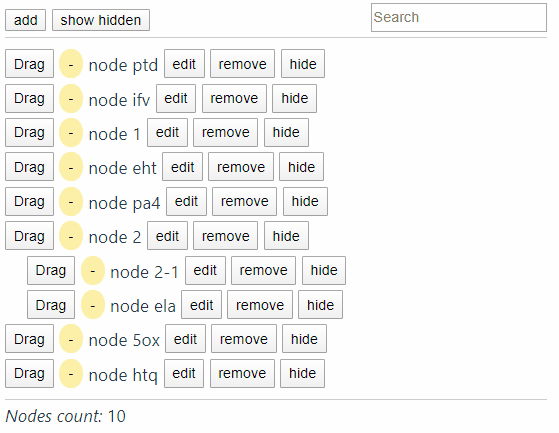

# @he-tree

A vue tree component. Some features: draggable, drag sortable, virtualization list, Vue2, Vue3, Typescript, lazy load, RTL. [Document](https://hetree.phphe.com)

Vue 树组件. 特点: 可拖拽, 拖拽排序, 虚拟列表, Vue2, Vue3, Typescript, 延迟加载子节点, 从右往左显示. [文档](https://hetree.phphe.com/zh)

- [Vue2](./packages/vue2)
- [Vue3](./packages/vue3)

## License

[MIT](http://opensource.org/licenses/MIT)
